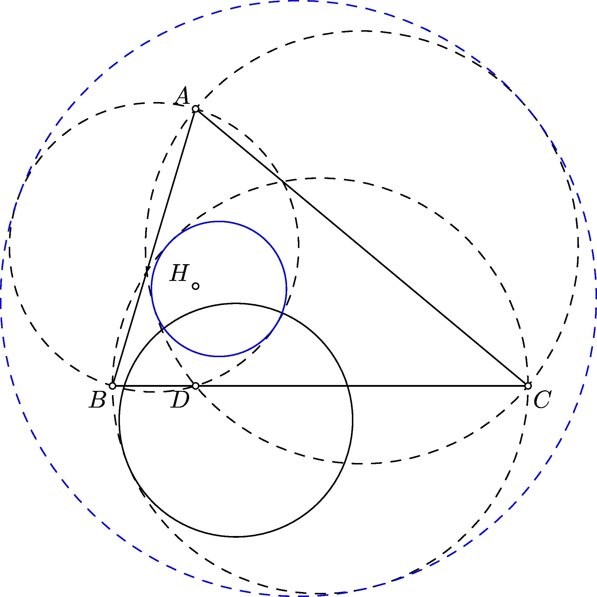

Cho tam giác $\triangle ABC$. Dựng đường tròn tiếp xúc ngoài với 3 đường tròn (BC), (CA), (AB) và đường tròn tiếp xúc trong với cả 3 đường tròn trên.

Cách dựng như sau: Gọi H là trực tâm tam giác ABC, D là chân đường cao từ A lên BC.

1 - Dựng đường tròn (Ka) tiếp xúc với đoạn HB, HC và tiếp xúc trong với (BC) (đường tròn Protasov).

2 - Nghịch đảo (Ka) qua phép nghịch đảo tâm A, tỷ số AH.AD được đường tròn IN.

3 - Nghịch đảo (IN) qua phép nghịch đảo tâm H, tỷ số HA.HD được đường tròn OUT.

```asy
import geometry;
unitsize(1cm);
defaultpen(fontsize(10pt));
point A=(2,5); dot(Label("$A$",align=NW),A);
point B=(0,0); dot(Label("$B$",align=SW),B);
point C=(8,0); dot(Label("$C$",align=SE),C);
triangle t=triangle(A,B,C); draw(t);

circle ca=circle(B,C), cb=circle(C,A), cc=circle(A,B);

draw(ca^^cb^^cc, dashed);

point H=orthocentercenter(t); dot(Label("$H$",align=NW),H);

point D=projection(t.BC)*t.A; dot(Label("$D$",align=SW),D);

point M=(t.B+t.C)/2;
point Ia=incenter(H,B,C);
point x=rotate(-90,M)*B;
point X=reflect(perpendicular(M, line(x, Ia)))*x;
point Ka=intersectionpoint(line(M, X), line(H, Ia)); draw(circle(Ka, abs(Ka-X)), dashed);

inversion invA=inversion(abs(A-H)* abs(A-D), A);
circle cin=invA*circle(Ka, abs(Ka-X)); draw(cin, blue);

inversion invH=inversion(-abs(H-A)* abs(H-D), H);
circle cout=invH*cin; draw(cout, blue+dashed);

dot(A^^B^^C^^D^^H, Fill(white));
```

